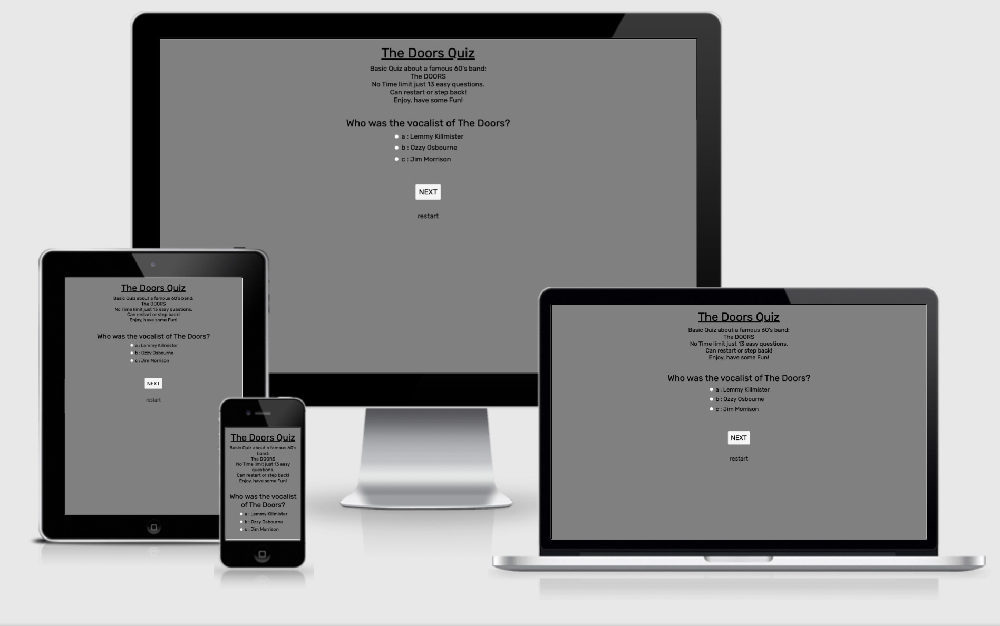
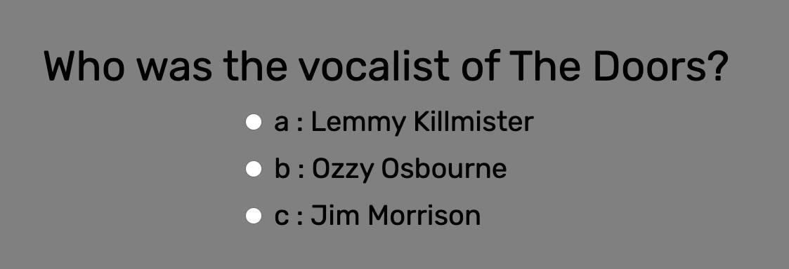
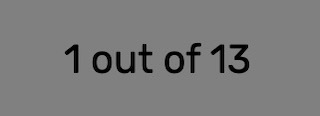
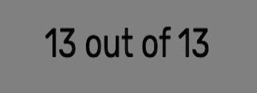
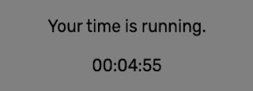
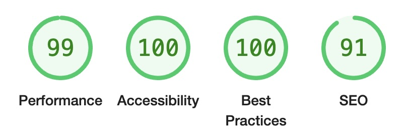

# The Doors Game
## Welcome to [The Doors Quiz](https://peterszabo79.github.io/project-no2/index.html)!

### The Doors Quiz contains 13 easy questions about a famous rock band: The DOORS, to measure the basic knowledge about the band. Users who try this small test can choose from three answers - all answers are music related, just need to choose the right ones.

---

# Features 
## Existing Features
- Header:
  - This header tells the user what is the name of the game.
  

- The Game Options:
   - 13 questions each with 3 answers, only one of them is the right one.
  

 - The Game Results:  
   - Shows how many right answer from the 13 questions.
   - No answer = wrong answer
   - 5 minutes timer, but can finish the quiz after it's run out.

      
     
     

- The Footer:
   - a link to the doors website opens in a new tab

## Features Left to Implement
- When there is time, I would like to expand this game, with a timer that can finish the game if 5 minutes it's gone, random questions etc.

## Design
- Color Scheme:
  - Used color are:
     - Black
     - Grey
     - Lightgrey
     - Whitesmoke

- Typography:
  - The fonts used are taken from google fonts named 'Roboto' and 'Rubik' with a fall-back of sans-serif.

---

# Testing
- I tested playing this game in different browsers: Chrome, Safari, Firefox, Opera.
- I confirmed that the game is counting the right answers always correctly.
- I confirmed that the colours and fonts chosen are easy to read and accessible by running it through lighthouse in dev tools.
- I confirmed that the timer shows a message when 5 minutes are gone.

---

# Validator Testing
- HTML
  - No errors were returned when passing through the official W3C validator.

- CSS
  - No errors were returned when passing through the official (Jigsaw) validator.

- JS:
  - No errors were returned when passing through the JSHint validator, but I have warnings.

- Accessibility
  - I confirmed that the colours and fonts chosen are easy to read and accessible by running it through Lighthouse in Devtools.

### Desktop 

### Mobile 

---

# Deployment
- The site was deployed to GitHub Pages. The steps to deploy are the follows:
  - In the Github repository, navigate to the Settings tab.
  - Scroll down to Pages and click on it.
  - Select Main Branch and click Save.
  - The page provides a link to the completed website.

The live link can be found here - [The Doors Quiz](https://peterszabo79.github.io/project-no2/index.html)

---

# Git & GitHub
I used GitPod as a local repository and IDE and GitHub as a remote repository. The process was:
  1. First i created a new repository on GitHub.
  2. I have then opened that repository on GitPod and started coding.
  3. In GitPod i have created all the pages and and folders.
  4. I was then saving my work and pushing it to GitHub repository to keep it safe.

Process for saving, commiting and pushing it to remote repository goes as follows (done in terminal):

 - `git add .` for adding work to git

 - `git commit -m "+ commit message"` to commit the work on the stage

 - `git push` to update work to GitHub

---

# Issues
 - I got warnings when I was passing through the code the JSHint validator.On stackoverflow.com found ` /*jshint esversion: 6 */ ` fixed most of them. but still have three warnings.

# Credits

<li>The "How to Make a Simple JavaScript Quiz" from sitepoint.com Walkthrough Project helped me from the beginning through to the finish of my project
</li>
<li>Wikipedia - correct answers can be found on wikipedia.</li>
<li>My cohort channel helped in fixing typing errors.</li>
<li>Google Fonts was used to choose my fonts, Roboto and Rubik.</li>
<li>Gitpod “Tips and Tricks” used during writing my project.</li>
<li>W3School was used while writing my project.</li>
<li>developer.mozilla.org was used while writing my project.</li>
<li>Grammarly was used to correct my text.</li>
<li>web.dev was used to test and improve UX.</li>
<li>Chrome Devtools was used for fixing my code all the way through my project.</li>
<li>My first project - Peter's Garage helped me for writing my README. </li>
<li>The Code Institute “rock-paper-scissor” Walkthrough Project helped me for writing my README.</li>
<li>Timer from "yo.fun"</li>

